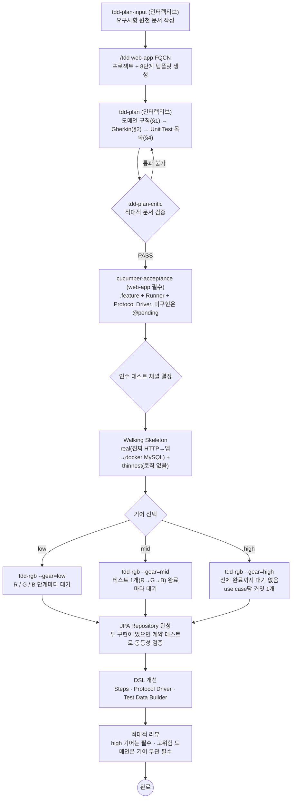

# tdd-plugin-verifier

> [msbaek-claude-plugins](https://github.com/msbaek/msbaek-claude-plugins)의 **msbaek-tdd 플러그인**을 실제 도메인으로 끝까지 관통시켜 검증한 기록이자, 다른 사람이 같은 과정을 따라 할 수 있게 만든 튜토리얼 저장소.

## 이 repo를 만든 이유

TDD 워크플로우를 자동화하는 플러그인은 "스킬 문서가 그럴듯한가"가 아니라 **"실제 기능 하나를 처음부터 끝까지 관통시킬 수 있는가"** 로만 검증할 수 있다. 이 repo는 msbaek-tdd 플러그인(1.38.0)의 web-app 파이프라인 전체를 **장바구니 결제 금액 계산**(상품 합계 → 쿠폰 할인 → 마일리지 차감 → 배송비 합산)이라는 실제 도메인으로 실행한 결과물이다. Gherkin 인수 테스트 15개가 실제 HTTP → Spring Boot → MySQL(Testcontainers)을 관통하고, 단위 테스트 9개가 순수 계산 함수의 세밀 분기를 덮는다.

특히 1.38.0에서 바뀐 **기어(gear)별 커밋 단위**를 검증하기 위해, 같은 use case를 세 개의 브랜치에서 세 번 구현했다:

| 기어 | 브랜치 | 커밋 수 | 커밋 단위 | 적대적 리뷰 |
|---|---|---|---|---|
| low | [`tdd-rgb-low`](../../tree/tdd-rgb-low) ([PR #1](../../pull/1)) | 39 | Red/Green/Blue 각 phase마다 | MAJOR 2건 발견·해소 |
| mid | [`tdd-rgb-mid`](../../tree/tdd-rgb-mid) ([PR #2](../../pull/2)) | 7 | 테스트 사이클(R+G+B)마다 | MAJOR 2건 (low와 다른 결함) |
| high | [`tdd-rgb-high`](../../tree/tdd-rgb-high) ([PR #3](../../pull/3)) | 2 | use case 하나 = 커밋 하나 | MAJOR 2건 (세 번째 독립 발견) |

세 브랜치의 `git log`를 나란히 보면 기어가 히스토리의 밀도를 어떻게 바꾸는지 그대로 드러난다 — 이것이 이 repo의 핵심 관찰 대상이다. (세 PR은 머지용이 아니라 비교·리뷰용이다.)

## msbaek-tdd 워크플로우 (요약)

상세 버전은 **[msbaek-tdd 워크플로우 지도](https://msbaek.github.io/talk-visuals/msbaek-tdd-workflow/)** 참조. 아래는 이 저장소가 실제로 밟은 경로로 축약한 것이다.



같은 `tdd-red` / `tdd-green` / `tdd-blue` 에이전트를 **몇 번이나, 얼마나 촘촘히 호출하느냐**만 기어가 바꾼다 — TDD 3법칙·한 번에 테스트 하나는 모든 기어에서 동일하다.

> 이 저장소는 요구사항 원천 문서(`docs/calculate-cart-requirements.md`)를 직접 작성해 `tdd-plan`에 넘겼다. 금액 계산은 고위험 도메인이라 세 기어 모두 적대적 리뷰를 받았고, `§7 JPA Repository`는 비교할 두 번째 구현(InMemory)이 없어 **범위 결정을 문서화하고 넘어갔다**.

## 튜토리얼

이 과정을 직접 따라 하려면:

| 문서 | 용도 |
|---|---|
| **[tdd-web-app-tutorial.md](docs/tdd-web-app-tutorial.md)** | **자세한 튜토리얼** — 각 단계의 판단 근거(plan-critic 3회 왕복, 적대적 리뷰 6건, 검증 극장 회피)까지 보존한 상세 기록판 |
| **[tdd-web-app-tutorial.html](docs/tdd-web-app-tutorial.html)** | **간결 튜토리얼** — 7단계를 "명령 → 생기는 것 → 확인" 패턴으로 압축한 따라하기판 ([바로 보기](https://htmlpreview.github.io/?https://github.com/msbaek/tdd-plugin-verifier/blob/main/docs/tdd-web-app-tutorial.html)) |
| **[claude-code-practices.md](docs/claude-code-practices.md)** | **협업 기법 모음** — 두 번의 검증 실험에서 얻은, 다른 프로젝트로 옮겨 쓸 만한 패턴(브랜치 실험 · 적대적 리뷰 · 조용한 실패 카탈로그 · 세션 간 피드백 루프) |

## 검증 과정에서 발견한 것들

플러그인 기능 검증을 넘어, AI 에이전트와 TDD를 함께할 때의 일반 원칙이 실측으로 확인됐다. 상세는 [claude-code-practices.md](docs/claude-code-practices.md) 참조.

- **에이전트의 자체 보고는 증거가 아니다** — Walking Skeleton 단계에서 서브에이전트가 "BUILD SUCCESS"를 보고했지만 직접 재실행하니 BUILD FAILURE였다(이후 13회 반복 실행으로 컨테이너 콜드스타트 플레이키로 판정). 성공 주장은 항상 직접 `mvn test`로 재검증해야 한다.
- **적대적 리뷰는 여러 번 돌릴 가치가 있다** — 세 번의 독립 리뷰가 매번 서로 다른 진짜 결함을 찾았다. 특히 "앞 리뷰의 수정이 만든 새 구멍"(4xx 판정이 404까지 삼킴)은 한 번의 리뷰로는 원리적으로 잡을 수 없다.
- **결함 검출을 정하는 것은 기어가 아니라 리뷰의 유무다** — 선행 실험에서 적대적 리뷰 절차가 없던 mid 기어 브랜치에는 CRITICAL 버그가 그대로 남았다. 기어는 기록의 밀도를 정할 뿐이다.
- **반복 오독되는 규칙 문장은 산문이 아니라 예시로 고정한다** — 검증 순서 규칙을 세 리뷰가 매번 반대로 읽었고, 구체 입력→기대 예외 예시 3개로 재작성한 뒤에야 오독이 멈췄다.
- **정본(single source of truth) 규율** — 모든 숫자·규칙의 정본은 [`Cart.md`](src/test/java/com/example/cart/Cart.md) §1이고, Gherkin(`.feature`)·단위 테스트·코드는 그 파생 뷰다. `.feature`가 실행되므로 문서와 코드의 드리프트가 구조적으로 차단된다.

## 실행 방법

```bash
# Docker 필요 (Testcontainers가 MySQL 8.4 컨테이너를 띄움)
mvn test
```

인수 테스트 15개 시나리오(2건은 채널 특성상 `@api-enforced`로 의도적 제외, 단위 테스트로 대체) + 단위 테스트가 모두 green이어야 한다.

## 주요 파일

```
docs/
├── calculate-cart-requirements.md   # 0단계: 사람이 쓴 요구사항 원천 문서
├── tdd-web-app-tutorial.md          # 자세한 튜토리얼
├── tdd-web-app-tutorial.html        # 간결 튜토리얼
└── claude-code-practices.md         # 두 실험에서 얻은 협업 기법
src/test/java/com/example/cart/
└── Cart.md                          # 8단계 진행 기록 + 도메인 규칙 정본(§1) — 이 프로젝트의 심장
src/test/resources/com/example/cart/
└── cart-checkout.feature            # §2 Gherkin의 실행 원본 (15 시나리오)
```

## 선행 실험

이 저장소 이전에 같은 플러그인을 **다른 도메인 조합**(결제 금액 계산 + 재고 기반 체크아웃)으로 검증한 실험이 있다: [msbaek-tdd-plugin-verification](https://github.com/msbaek/msbaek-tdd-plugin-verification) (보존용 archive).

그 실험의 결론과 발견은 [claude-code-practices.md](docs/claude-code-practices.md)에 **실험 B**로 통합했다. 특히 거기서 적대적 리뷰가 발견한 오버셀 결함이 플러그인의 경계 조건 다섯 번째 범주("집계 경계", 1.20.0)가 되었고, **이 저장소의 계획 단계가 그 항목 덕분에 같은 결함 유형을 설계로 선제 커버**했다 — 도구에 반영된 교훈이 다음 프로젝트에서 공짜가 되는 과정이 두 저장소에 걸쳐 기록돼 있다.

## 관련 링크

- [msbaek-tdd 워크플로우 지도](https://msbaek.github.io/talk-visuals/msbaek-tdd-workflow/) — 전체 절차와 기어별 스킬 라우팅
- [msbaek-claude-plugins](https://github.com/msbaek/msbaek-claude-plugins) — [`msbaek-tdd`](https://github.com/msbaek/msbaek-claude-plugins/tree/main/msbaek-tdd) 플러그인 소스
- [msbaek-tdd-plugin-verification](https://github.com/msbaek/msbaek-tdd-plugin-verification) — 선행 검증 실험 (archive)
